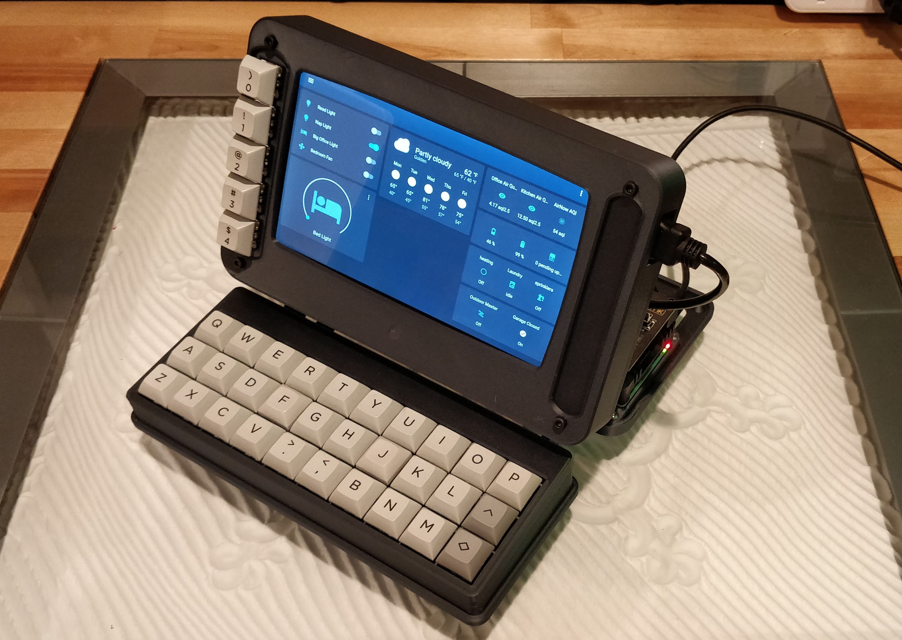
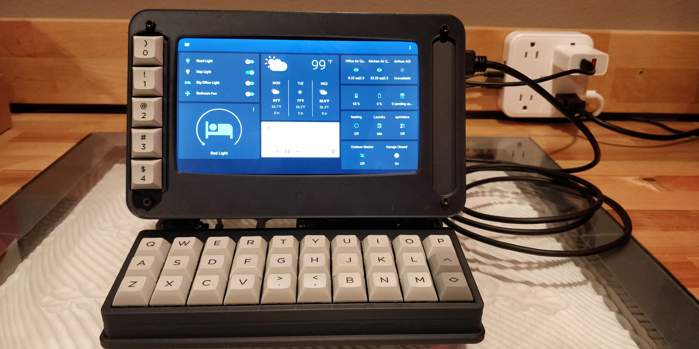
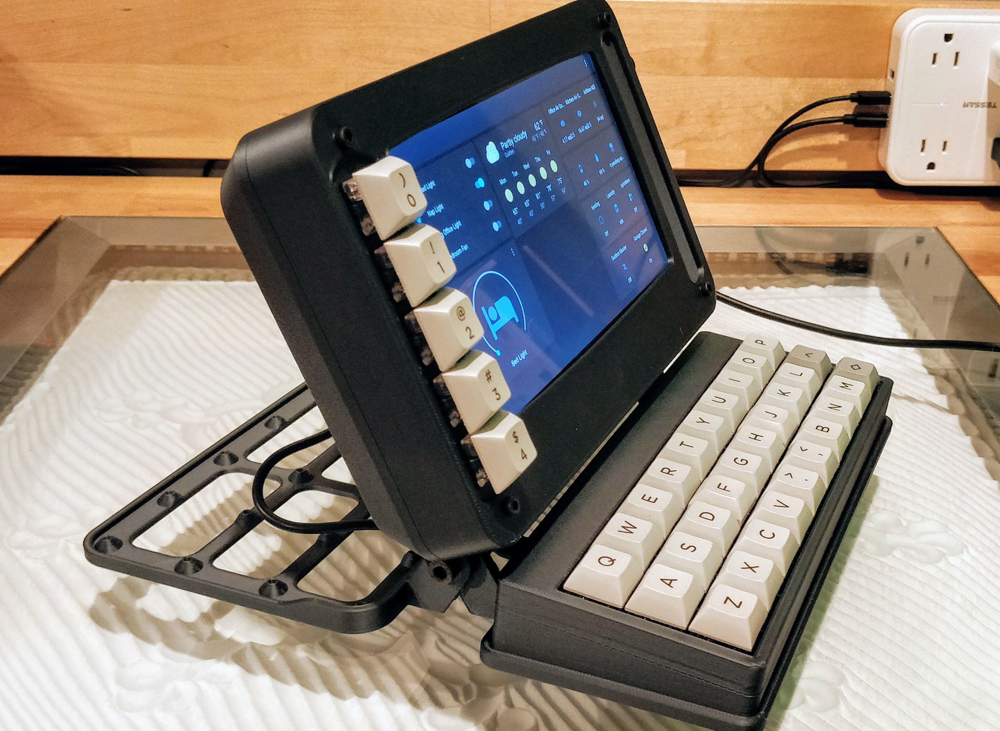
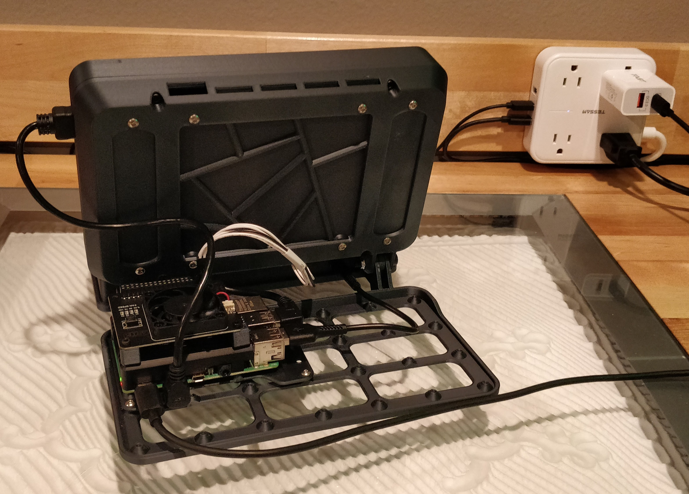
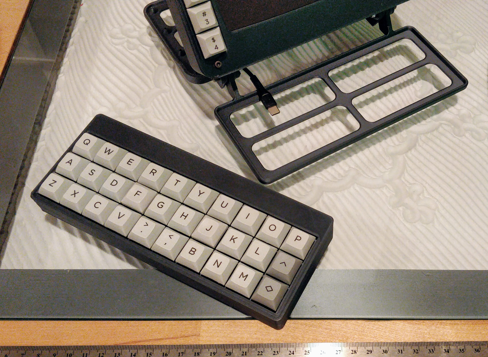
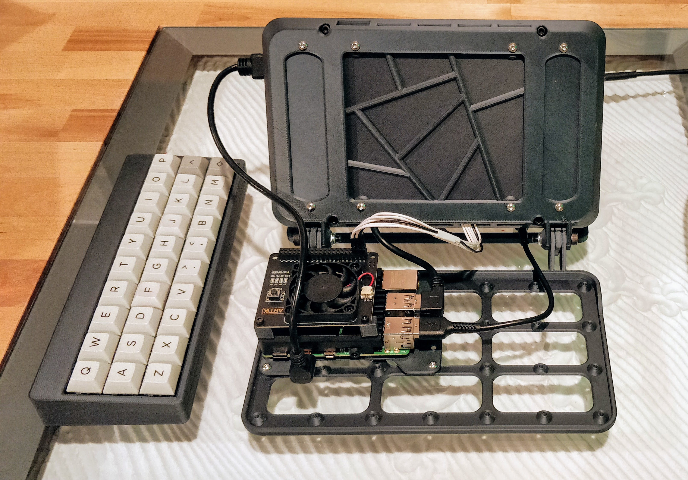
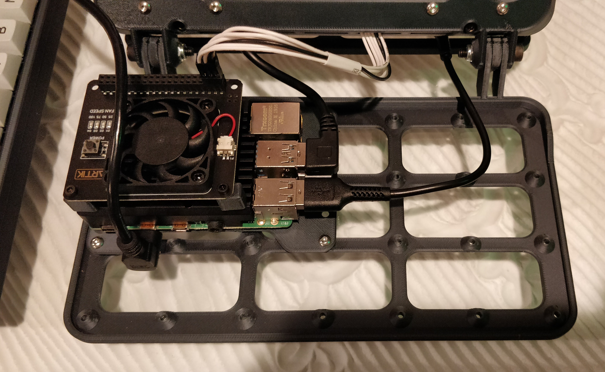
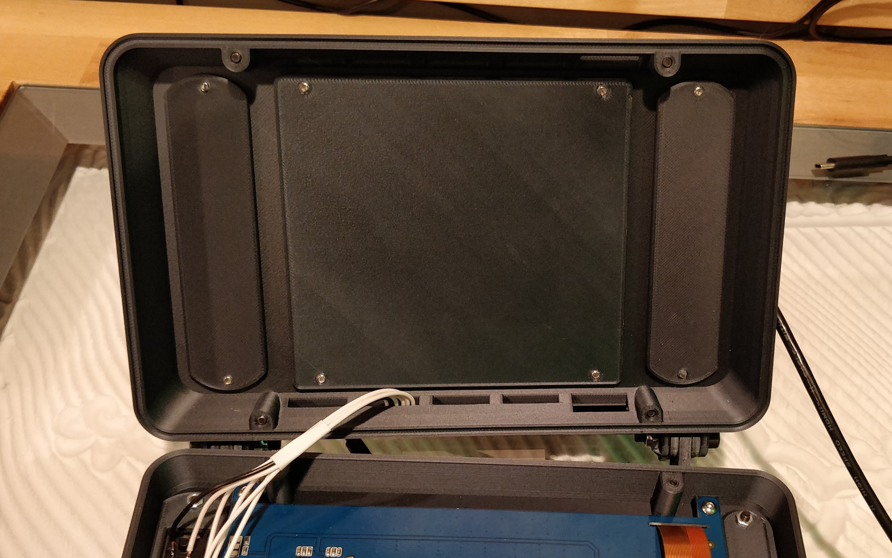

# OLKB-Terminal

Terminal with builtin ortholinear keyboard and touch screen as a home automation interface.

## Features

- Step and STLs available for non-commercial use.
- 7" Touch Screen
- Raspberry pi 4
- Home assistant loads in kiosk mode.
- 5x1 buttons to interact directly with home assistant with physical buttons
 

- Customizable panels for the front, 3 in the back and a grid for custom attachments.

- void30 ortho linear key board running qmk open source firmware.

## Bill of Materials (BOM)

Note: I chose these because I mostly already had them. There are many other choices available. Some
will be less expensive and some will work better. Some will just be different, but you might prefer
them. That's all part of the fun.

### Printed Parts

I used the [Ziro Carbon Fiber PLA Filament](https://amzn.to/39prwRQ).

| Part Name                     | Qty  | X size (mm)   | Y size (mm)   |
| ----------------------------- | ---- | ------------- | ------------- |
| Screen Front                  | 1    | 214           | 133           |
| Screen Rear                   | 1    | 214           | 133           |
| Void30 Base Plate             | 1    | 207           | 111           |
| Rear Base Plate               | 1    | 211           | 139           |
| Pi Plate                      | 1    | 106           | 74            |
| 5x1 Front Acc Panel           | 1    | 119           | 22            |
| Small Front Acc Blank Panel   | 1    | 120           | 16            |
| Rear Large Blank Panel        | 1    | 116           | 107           |
| Rear Small Blank Panel        | 2    | 107           | 27            |
| Fan Offsets (optional)        | 2    | 10            | 10            |

These parts are licensed CC-BY-NC. That means you can't charge for them, and you can't send them to
a shop that charges for prints.

I have designed these to be as easy to print as possible, but if you really want to buy a printed
set, contact me and I'll see what solutions we can find.

### Raspberry Pi Components

| Name                             | Link                    |
| -----                            | ----                    |
| Screen (C) [1]                   | https://amzn.to/3ztpCKe |
| Raspberry Pi 4 2GB               | https://amzn.to/3nM6MMq |
| SD Card [2]                      | https://amzn.to/3Cx8bug |
| USB Drive [2]                    | https://amzn.to/3EDvPaz |
| Power Supply                     | https://amzn.to/2XvkFU4 |
| Power Cable (USB-C on both ends) | https://amzn.to/3lLiLae |
| Case                             | https://amzn.to/3kqMV3l |
| Fan                              | https://amzn.to/39kYTVV |

[1] I have this version, which is more than a year old now. There is a newer version of the screen that looks like it has some nice features:
   - Screen IPS (H) version: https://amzn.to/3hPevp4
   
[2] I use a USB Drive to run the pi. If you do that too, you can just use any 8GB+ micro SD card to
get the raspberry pi booted, and then use the USB drive from then on.

### Void30

Take a look at the [victorlucachi/void30](https://github.com/victorlucachi/void30) repo for details.

I used an
[Elite-C](https://keeb.io/products/elite-c-low-profile-version-usb-c-pro-micro-replacement-atmega32u4)
microcontroller, which is essentially an Arduino Pro Micro with a USB-C port.

### Cables

| Name                                         | Link                    |
| -----                                        | ----                    |
| Micro HDMI Video Cable                       | https://amzn.to/3tWw2QZ |
| Micro USB Right Angle Touch Screen Cable     | https://amzn.to/39kEMXI |
| USB-C for Void30 (If you have a USB-C)       | https://amzn.to/3lLH9IQ |
| Power Cable (USB-C on both ends)             | https://amzn.to/3lLiLae |

Make sure you get the right cable for your Void30 microcontroller. You need one that is about 6inches (15cm).

### Screws

| Location         | Size           | Min. Qty   |
| ---              | -------------- | ---------- |
| Hinge            | M5x15mm+       | 2          |
| Hinge            | M5 Lockhnut    | 2          |
| Screen Case      | M4x14mm-20mm   | 4          |
| Accessory Mounts | M3x6mm         | 18+        |

### 5x1 Front Switch Panel

You should have enough leftovers from the Void30 build. Except for the Dupont connectors.

- Wires, 24awg-28awg should be fine. I would guess the farthest one is less than 8" (20cm) long.
- 5x cherry mx compatible switches
- 5x cherry mx compatible keycaps, but I hope to release some STLs for printable ones soon.
- 2x3 Dupont connector. If you aren't already prepared to crimp dupont connectors, I would try to
  find a 2x3 dupont cable and just cut off the other end to solder.
- Heat shrink. Optional, but makes these wires a little more tidy.

## Scripts/Setup

I have a very peculiar raspberry pi setup. If this project takes off, I would consider making a custom image for it.
But this can be accomplished with a regular raspian setup.

Until then, these are some of the key parts I used to get the software/OS side working:

1. Home Assistant should already be running (probably on another machine).
2. Change your user password, please.
3. Install chromium browser. Any browser should work ok, but chromium has a kiosk mode.
   - The command I use to launch the browser is: `/usr/bin/chromium-browser --kiosk --noerrdialogs --enable-features=OverlayScrollbar --disable-restore-session-state http://homeassistant:8123`
4. Use `raspi-config` to auto login.
5. Disable screen savers. I do that so I can see what is on the screen without touching it. Run these commands at startup. Check to see if they work with `xset q`:
    `xset s noblank`
    `xset s off`
    `xset -dpms`
6. [Set up the `buttons.py`](buttons/)

## Connected Projects

This project is very dependent on a lot of other open source and hardware projects.

 - [Home Assistant](https://home-assistant.io) let me write a few lines of code and scripts instead of thousands to get a clean interface.
 - [victorlucachi/void30](https://github.com/victorlucachi/void30) made a fun keyboard that is not only a perfect fit, but it inspired some of the design choices in CAD. 
 - [qmk_firmare](https://qmk.fm/) QMK Firmware is the brains of the void30 and is a pleasure to work with.
 - [browser_mod](https://github.com/thomasloven/hass-browser_mod) makes it possible to control the display with home assistant automations.

Of course, raspberry pi, Linux, and a thousand projects related to getting a computer running on a pi are also integral.

# License

This version of this project Has shapes and measurements based off of the Void30 project by @victorlucachi. That project, and
this one are licensed under a [Creative Commons Attribution-NonCommercial 4.0 International License](https://creativecommons.org/licenses/by-nc/4.0/).

