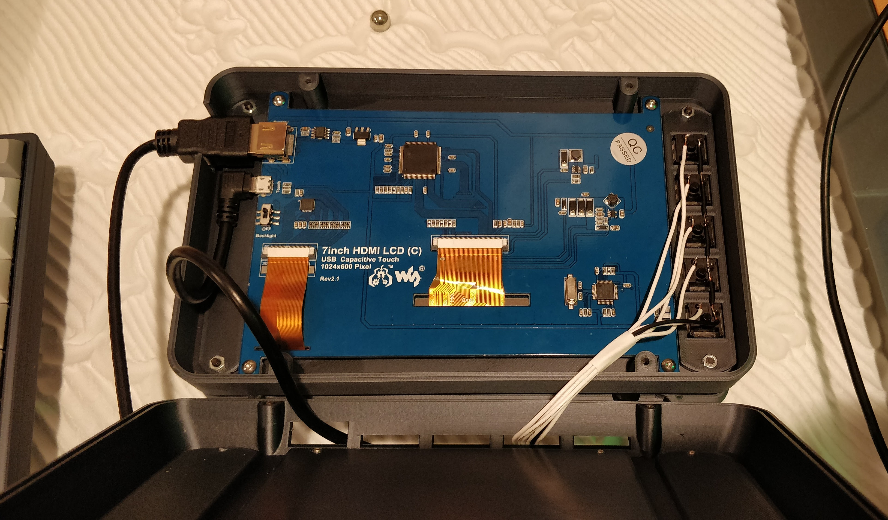

## 5x1 Button Set Up

This isn't going to be a beginner guide. But I hope it is easy enough to follow. If you are having
trouble, ask me, or ask a friend and we can update these instructions for the next user.

1. Take a look at the [script](olkb-terminal-buttons.py). You might want to look at the documentation for
   [gpiozero.Button](https://gpiozero.readthedocs.io/en/stable/api_input.html#button).
2. The script will check for pins 16, 19, 20, 21, 26 and if any of them connect to ground, it will trigger an automation named:
    `olkb-terminal-button-0`, or any from 1-4.
3. Wire up the buttons.


I wired all the terminals on the right side of the switches together and tied them to ground. I then
wired each of the other sides of the switches to their own pins at the end of the GPIO on the rpi4.

[Here is a handy pinout](https://pinout.xyz/pinout/pin35_gpio19#)

4. Get the long lived access token for your home assistant setup. This may get out of date, but
   right now, you can click on your account in the HA interface and navigate to the bottom and add a
   long lived access token. Give it a name like, "olkb-terminal" and then past it in the buttons.py
   script.
   
5. Test the script. You should be able to do something like `python3 buttons.py` and then press the
   buttons. You should see messages coming back indicating that buttons were pressed.
   
6. Set up your automations. The script calls automations like `olkb-terminal-button-0`. In HA, have
   them trigger something you can test with. Like a notification, or toggling a light switch.
   
7. Set up `browser_mod` in your Home Assistant. Browser mod is very powerful and is popular enough
   to have a lot of good tutorials on it already. But if you get stuck, this is what one of my
   automations looks like:

```yaml
  alias: olkb-terminal-button-0
  description: What to do when we press a button on the olkb terminal screen
  trigger: []
  condition: []
  action:
  - service: browser_mod.navigate
    data:
      deviceID: <put your deviceID here>
      navigation_path: /lovelace-terminal/0
```

